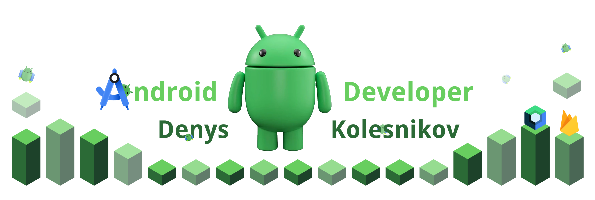

<h1 align="center">Hi there, I’m Denys Kolesnikov! 👋</h1>
<h3 align="center">
  Android & KMM Developer | AOSP Customizations | Hardware Integrations
</h3>

  
  
  

---

## 💡 About Me

I am a dedicated **Android Developer** with 7+ years of experience and expertise in:

- **Native Android** (Kotlin/Java)
- **Kotlin Multiplatform Mobile (KMM)** for cross-platform (Android, iOS & Desktop)
- **AOSP** customizations (system-level & hardware integration)
- **Build automation & CI/CD** (Jenkins, Bitrise)
- **Factory testing solutions**
- **MDM (Mobile Device Management) for AOSP-based devices** — developed from scratch with focus on
  architecture and security

### Throughout my career, I have:

- Created and published my own product from the idea stage to release on the Play
  Market [Story Door](https://play.google.com/store/apps/details?id=com.create.story.studio.story.door)
- Collaborated with large, cross-functional teams
- Explored optimal architectures and technologies for new products
- Presented findings at meetups, showcasing AOSP-based solutions and architectural approaches
- Provided mentorship and guidance to fellow developers

> _"I’m passionate about optimizing development processes, enhancing user experiences,  
> and leveraging modern Android/KMM tools—even at the system level!"_

## 🛠️ Tech Stack & Tools

  
  
  

### **AOSP Modifications and OS Development**

- Developing custom launchers, notifications, and settings
- Designing custom notification shades
- Integrating OTA updates
- Adding custom permissions & root-level apps
- Creating additional system services
- Optimizing Qualcomm drivers & system build processes
- Integrating MDM services for device management

### **High-Level Android Technologies & Libraries**

- **Play Market**: Publishing, AdMob, In-app Billing, Referrer
- **Kotlin**: Coroutines, Flows
- **Tests**: UI Tests, Unit Tests, Snapshot Tests
- **Google SDK**: Maps, Geocoder, Auth
- **Android Jetpack**: Compose, DataBinding, Material 3, Room, Navigation, Paging, CameraX, Motion
  Layout
- **Facebook SDK**: Deeplink, Auth
- **Amazon SDK**: AWS Cognito
- **Firebase**: Analytics, Crashlytics, Storage, Realtime DB, Cloud Messaging, ML
- **Payment & Monetization**: LiqPay, Stripe
- **Analytics**: Adjust
- **Push Notifications**: OneSignal
- **Visual Components**: GraphView, AutoImageSlider, PhotoView
- **Image Loading**: Picasso, Glide
- **Networking**: Retrofit, GSON
- **API**: Postman
- **QR Code**: Code-scanner
- **DI**: Dagger2, Koin
- **IoT**: BLE, WIFI, RTSP, MQTT, IpCamera Streaming

### **Architectures**

- **MVC**, **MVP**, **MVVM**, **MVI**, **AAC** (Android Architecture Components), **Clean
  Architecture**, **Best Practices**

### **Hardware-Level & IoT**

- **Wireless Connectivity**: Wi-Fi, GPS, Bluetooth (Classic & BLE)
- **OTA Firmware Updates**: Bluetooth-based firmware updates
- **Hardware Drivers**: For Texas Instruments, Qualcomm (Java/Kotlin)
- **IoT Solutions**: BLE beacons, ESP32, IP cameras for smart-home systems

  
  
  

#### **Cross-Platform Experience (Android/IOS/Desktop)**

- KMM - While working on KMM projects, gained knowledge of Xcode and Swift to develop pet apps.
  Integrated **Google Sign-In**, **Firebase Database** & **Realtime DB** for seamless auth & data
  handling.
- Flutter & Dart ~3 months of experience, creating cross-platform apps (Android & iOS)

  
  
  
  
  

### **IDEs & Developer Tools**

  
  
  
  

### **Version Control & CI/CD**

  
  
  
  
  
  

### **DevOps & Cloud**

  
  
  

### **Databases & Backend**

  
  
  
  

### Additional Skills

- **Figma**, **Photoshop**, **Illustrator**, **Adobe XD**
- **LmStudio**

## 🤝 Soft Skills
- Effective communication & collaboration
- Open to feedback
- Aligning development goals with business objectives
- Skilled in multitasking & prioritizing

## 🌐 Languages

- **English** – Intermediate
- **Ukrainian** – Native
- **Russian** – Native

---

## 🎉 Hobbies & Personal Projects
- [Application **Story Door** 📚 on Google Play ](https://play.google.com/store/apps/details?id=com.create.story.studio.story.door) - (Completed) Application for Writers
  - **Platform**: Android
  - **Tech Stack**: XML-based UI, Kotlin, MVVM, Clean Architecture, Dagger2, Firebase analytics/crashlytics 
- Application **Story Door 2** 📚 - (In Develop) Application for Writers
  - **Platform**: Android, iOS (future Desktop)
  - **Tech Stack**: **KMM**, Jetpack Compose, Firebase, Google Auth, MVI, Koin, Firebase storage/database
  - More advanced, cross-platform version of Story Door 
  - Shares code across Android & iOS
  - Uses Firebase for real-time data sync
  - Future plans to support desktop
- **Building touchscreen-based mini-computers**: using Arduino Uno, designing control units for
  power electronics, implementing a touchscreen UI
- **Smart Home Gadgets**: Arduino, ESP32, BLE & Wi-Fi + Android apps
- **Raspberry Pi**: Various side projects
- **Electronics Enthusiast**: Embedded solutions & hardware tinkering

---

## ✨ Professional Summary

I’m a dedicated **Android & KMM Developer** specializing in **native Android** and **multiplatform
solutions**. My **AOSP** customizations include creating custom launchers, designing factory testing
tools, and building MDM systems from the ground up. Proficient in **Kotlin/Java** and **CI/CD** best
practices, I strive to deliver high-performance, scalable apps. I’m driven by a desire to innovate,
learn, and elevate user experiences across platforms.

---

## Let’s Connect

  
  
  

> Most of my public repositories here are fairly **outdated**. If you’d like to see my current
> coding style, feel free to reach out — my larger pet projects are in private repos (🔒)! I’d be
> glad
> to walk you through the code in a personal Zoom session if we connect. 🤝

---

  <strong>Made with ❤️ for Android Development</strong>

---